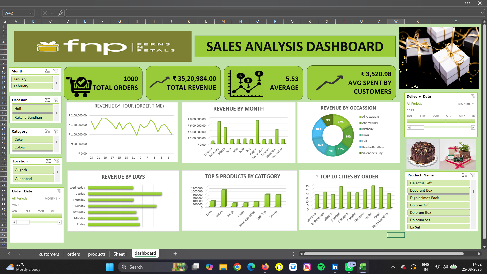
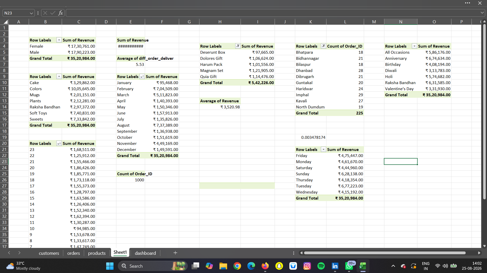
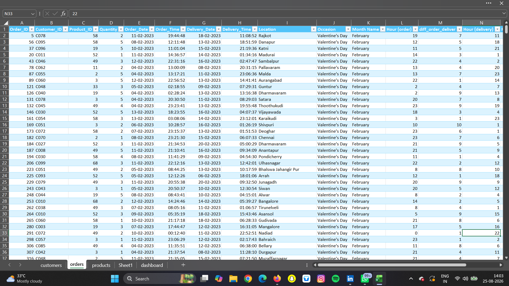

# FNP_Sales_Analysis_Dashboard
Developed an interactive FNP Sales Analysis Dashboard using Excel to analyze 1,000 sales orders generating ₹35.21 lakh in total revenue, uncovering key sales trends across products, occasions, cities, and time periods to support data-driven business decisions.
---

##  Key Performance Indicators

| KPI | Result |
|---|---:|
|  Total Orders | **1,000** |
|  Total Revenue | **₹35.21 Lakh** |
|  Total Units Sold | **3,045** |
| Average Order Value | **₹3,520.98** |
|  Customers | **100** |
|  Products | **70** |
| Average Delivery Time | **5.53 Days** |

---
##  Dashboard Preview

### Interactive Sales Analysis Dashboard

###  Supporting Analysis

###  Raw Data

##  Key Insights

###  Product & Category Performance

- **Colors** was the highest-revenue category, generating **₹10.06 lakh (28.56%)** of total revenue.
- **Soft Toys** generated **₹7.41 lakh (21.04%)**.
- **Sweets** generated **₹7.34 lakh (20.84%)**.
- These insights help identify high-performing categories for **inventory prioritization and promotional planning**.

###  Occasion Analysis

- **Anniversary** generated the highest occasion-wise revenue of **₹6.75 lakh (19.16%)**.
- **Raksha Bandhan** contributed **₹6.32 lakh (17.94%)**.
- This analysis helps identify high-demand occasions for **targeted marketing campaigns and seasonal planning**.

###  Time-Based Analysis

- **August** was the highest-revenue month with **₹7.37 lakh (20.94%)**.
- **Tuesday** generated the highest day-wise revenue at **₹6.77 lakh (19.23%)**.
- **8 PM** was the highest-revenue ordering hour, generating approximately **₹1.86 lakh (5.29%)**.
- These trends help identify **peak sales periods** for promotional and operational planning.

###  City Analysis

- Analyzed the **Top 10 cities by order volume** to identify locations with stronger customer demand.
- This provides insights for **regional marketing, customer targeting, and sales expansion strategies**.

###  Delivery Analysis

- Calculated an average delivery time of **5.53 days**.
- This provides a measurable benchmark for monitoring **order fulfillment and operational performance**.

---

##  Business Impact

The analysis converts raw transactional data into insights that can support:

-  **Inventory Planning** — prioritize high-performing categories and products.
-  **Marketing Strategy** — target high-performing occasions and customer segments.
-  **Sales Planning** — focus promotions around peak months, days, and ordering hours.
-  **Regional Strategy** — identify cities with stronger order demand.
-  **Product Strategy** — understand which categories contribute most to revenue.
-  **Operational Monitoring** — track delivery performance using measurable KPIs.

---

##  Dashboard Features

The dashboard provides an interactive view of sales performance using:

- KPI Cards
- Revenue Analysis
- Product & Category Analysis
- Occasion Analysis
- City-Wise Order Analysis
- Monthly & Daily Sales Trends
- Hourly Order Analysis
- Delivery Performance
- Interactive Slicers & Filters

---

##  Tools & Skills Used

### Microsoft Excel

- Data Cleaning & Preparation
- Data Transformation
- Excel Formulas
- Pivot Tables
- Pivot Charts
- Slicers
- KPI Development
- Interactive Dashboard Development
- Data Visualization

### Data Analytics

- Exploratory Data Analysis
- Sales & Revenue Analysis
- Product & Category Analysis
- Occasion Analysis
- Time-Based Analysis
- Geographic Analysis
- Trend Analysis
- Business Intelligence
- Data-Driven Decision Making
- Business Insight Generation

---

##  Project Outcome

Successfully transformed **1,000 raw sales transactions into an interactive business intelligence dashboard**, enabling quick identification of **revenue drivers, high-performing categories, peak sales periods, customer demand patterns, and operational metrics**.

This project demonstrates my ability to move from:

**Raw Data → Data Analysis → Visualization → Business Insights → Data-Driven Decisions**

